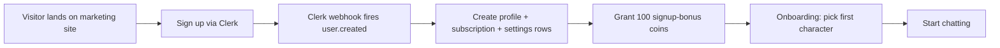

# 00 — Project Summary

> **Document audience:** Everyone. This is the entry point for understanding *what Lucy is* before diving into any technical detail.
>
> **Status:** Generated from the codebase on 2026-06-09. Statements marked **⚠️ Assumption** are inferred where the code did not state a fact explicitly.

---

## 1. What Lucy Is

**Lucy AI** is a subscription-based **AI companion / character-chat platform**. Users sign up, choose (or create) an AI "character", and have ongoing text conversations with it. The product layers in long-term **memory**, **relationship progression**, optional **voice messages**, and **in-chat image generation**, all gated behind a **freemium subscription** model backed by a **virtual coin economy**.

It is built as a single **Next.js 16** web application (App Router, React 19, TypeScript), deployed to a serverless host (Vercel-class), with managed third-party services for the heavy lifting:

| Concern | Provider |
|---|---|
| Authentication & user identity | **Clerk** |
| Database (Postgres + RLS + Realtime) | **Supabase** |
| Large Language Models | **OpenRouter** (model router) |
| Payments & subscriptions | **Stripe** |
| File / media storage | **Cloudflare R2** |
| Text-to-speech (voice) | **OpenAI TTS** (optional) |
| Rate limiting | **Upstash Redis** |
| Re-engagement | **Web Push** (VAPID) |

---

## 2. Business Purpose

Lucy monetizes **emotional engagement and conversational entertainment**. The core value proposition is a personalized AI companion that *remembers* the user, *grows closer* over time, and is always available. Revenue is recurring (monthly subscriptions) supplemented by a metered coin economy that creates natural upgrade pressure.

The platform is also built for **white-label resale**: a `tenants` table and tenant-resolution layer (`src/lib/tenant.ts`) allow the same codebase to power multiple branded instances with custom names, logos, and colors.

> **⚠️ Assumption:** The companion characters are presented as romantic/relationship-oriented ("my girls" dashboard, `relationship_status` enum of `stranger → partner`, plan copy like "Deeper connections"). The product is therefore an **adult companion / AI-girlfriend** style application. This shapes the security, moderation, and content-policy considerations throughout these docs.

---

## 3. User Types

| User type | How identified | Capabilities |
|---|---|---|
| **Anonymous visitor** | No Clerk session | Browse marketing pages, pricing, public character catalog |
| **Free user** | `profiles.plan = 'free'` | 30 messages/day, 1 character, basic memory, 100 welcome coins |
| **Premium user** | `profiles.plan = 'premium'` | Unlimited chat, 3 characters, voice messages, voice calls (60 min/mo), 2,000 coins/mo |
| **Ultimate user** | `profiles.plan = 'ultimate'` | Everything + unlimited characters, image generation, unlimited voice, 6,000 coins/mo |
| **Admin** | Clerk session claim `metadata.role = 'admin'` **or** `profiles.is_admin = true` | Full admin panel: users, characters, AI models, economy, billing, analytics |
| **Banned user** | `profiles.is_banned = true` | Blocked from all write/chat actions (HTTP 403) |

---

## 4. Main Workflows

### 4.1 New-user onboarding

### 4.2 Chatting
1. User opens a character → `POST /api/chat/start` creates/returns a conversation.
2. User sends a message → `POST /api/chat/[id]/messages`:
   - Rate-limit check → ban check → daily-limit check.
   - Input passes **moderation + prompt-injection** guard.
   - **1 coin** is debited atomically.
   - Message history + memories + conversation summary are assembled into a system prompt.
   - The reply is **streamed** back from OpenRouter (NDJSON).
   - Output passes a **leak/moderation guard**, usage is logged, relationship status is updated, and **memories are extracted** asynchronously.

### 4.3 Upgrading
1. User picks a plan → `POST /api/subscription/upgrade` creates a **Stripe Checkout** session.
2. On payment, Stripe webhooks (`checkout.session.completed`, `invoice.paid`) sync the subscription and **grant the monthly coin allowance**.

### 4.4 Admin management
Admins manage the character catalog, the allow-list of AI models, the coin economy and feature flags, review reports, ban users, grant coins, and view revenue / usage / cohort analytics.

---

## 5. Revenue Model

| Layer | Mechanism |
|---|---|
| **Primary** | Recurring subscriptions: **Premium $14.99/mo**, **Ultimate $39.99/mo** (Stripe) |
| **Metered usage** | Coin economy: text = 1 coin, image = 20 coins, voice = 10 coins/min. Coins replenish monthly per plan and are the lever for upgrade pressure. |
| **Acquisition** | Free tier (30 msgs/day, 1 character, 100 welcome coins) as a funnel |
| **Potential (not yet built)** | Coin top-up purchases (`coin_reason` enum already supports `purchase`), character marketplace, white-label licensing of the platform via `tenants` |

> **⚠️ Assumption:** One-off coin purchases are *modeled* (the `purchase` ledger reason exists) but **no checkout path for buying coins was found** — only subscription checkout. Treated as a roadmap item.

---

## 6. Key Features

- **AI character chat** with streaming replies and per-character system prompts/models.
- **Long-term memory**: facts are auto-extracted from conversations and re-injected into future prompts (`memories` table, `memory-extract.ts`).
- **Relationship progression**: `stranger → acquaintance → friend → close → partner` driven by message count.
- **Conversation summaries** for long-context continuity (`conversations.summary`).
- **Coin economy** with atomic, idempotent, audited debits/credits (`coin_ledger`, `spend_coins`/`grant_coins` RPCs).
- **User-created characters** (private, plan-limited).
- **Voice messages / TTS** (Premium+) and a voice-call beta.
- **In-chat image generation** (Ultimate).
- **Full admin panel** with analytics, cohorts, and unit economics.
- **Multi-tenant / white-label** support.
- **Web push re-engagement**.
- **Security layer**: moderation, prompt-injection detection, output-leak guarding, auto-suspend on repeated abuse.

---

## 7. Future Roadmap Opportunities

These are inferred from partially-built scaffolding in the codebase:

| Opportunity | Evidence in code |
|---|---|
| **Coin top-up purchases** | `coin_reason.purchase` exists but no buy-coins flow |
| **True image generation** | `image-gen.ts` currently routes through a text model; a dedicated image model (Fal/Replicate/DALL·E) would complete it |
| **Real-time voice calls** | `voice_calls_beta` feature flag + voice page scaffold |
| **White-label go-to-market** | `tenants` table + tenant resolver are present but only the default `lucy` tenant is seeded |
| **Push-driven re-engagement campaigns** | `push_subscriptions` captured; sending side not yet implemented |
| **Tighten CSP & replace placeholder image hosts** | `next.config.ts` still allows `unsplash`/`picsum` with a TODO to remove |

---

## 8. Where To Go Next

| You are… | Read |
|---|---|
| A non-technical stakeholder | [01 — Client Guide](01-client-guide.md) |
| Evaluating the architecture | [02 — System Architecture](02-system-architecture.md) |
| A new developer | [04 — Folder Structure](04-folder-structure.md) → [06 — API](06-api-documentation.md) |
| Rebuilding from scratch | [15 — Rebuild Guide](15-rebuild-from-scratch-guide.md) |
| Assessing risk | [10 — Security](10-security-documentation.md) + [PROJECT_INDEX](PROJECT_INDEX.md) (Risk Assessment) |
