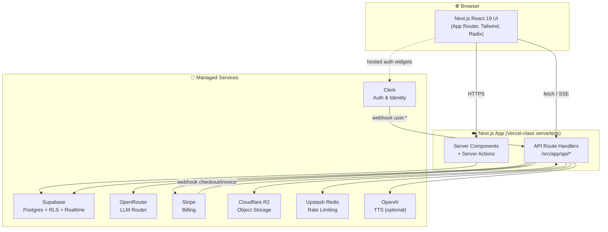
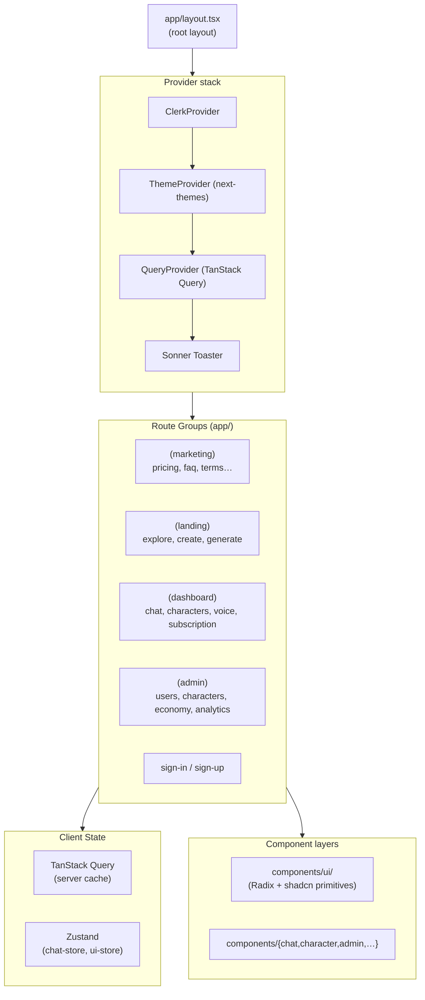
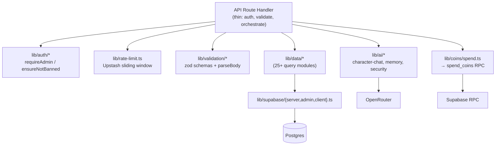
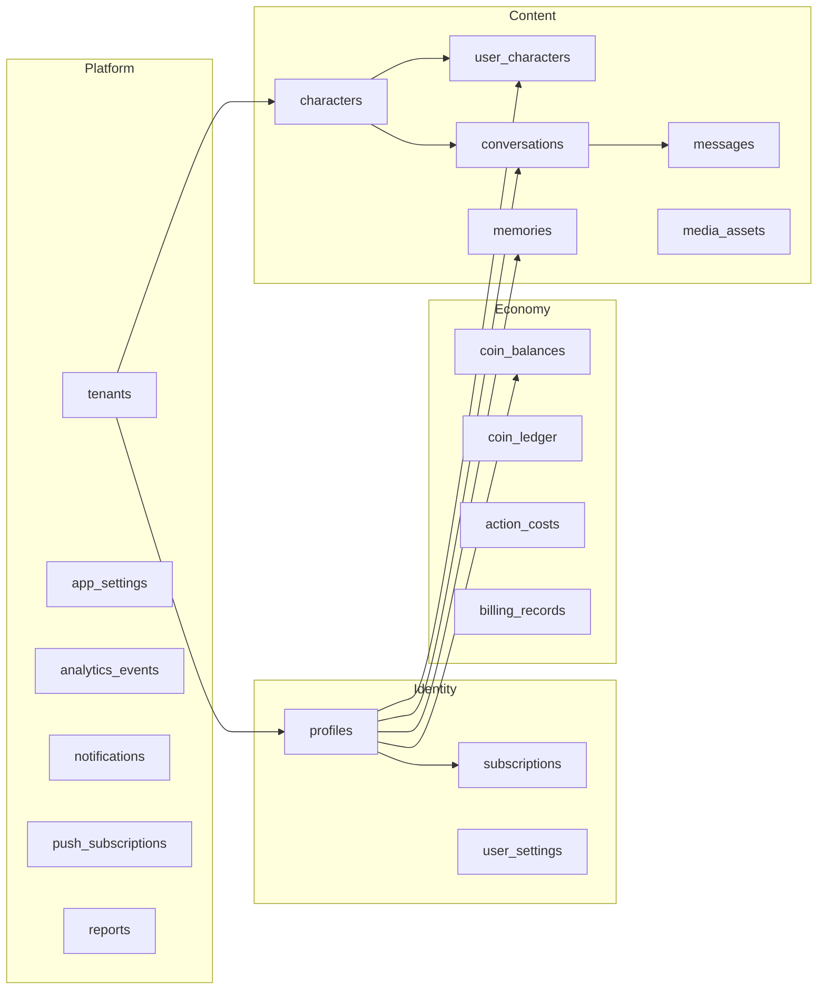
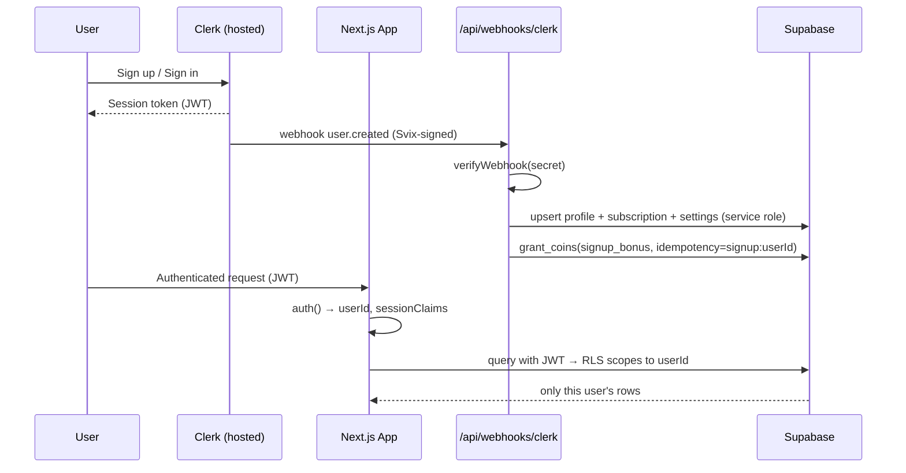
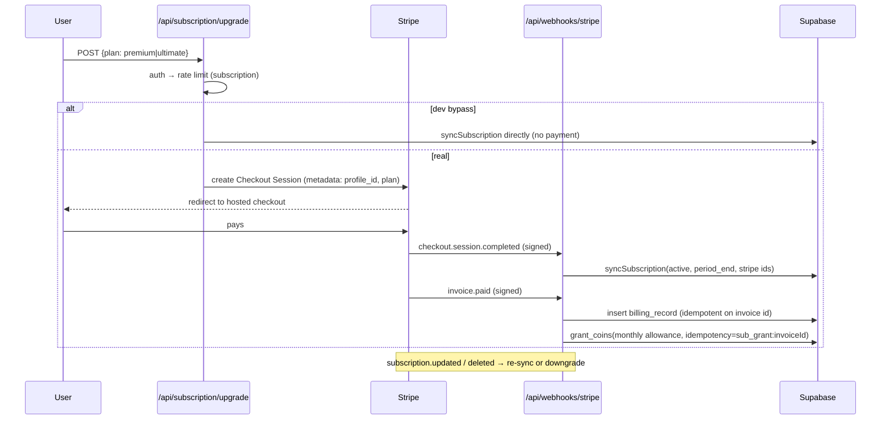
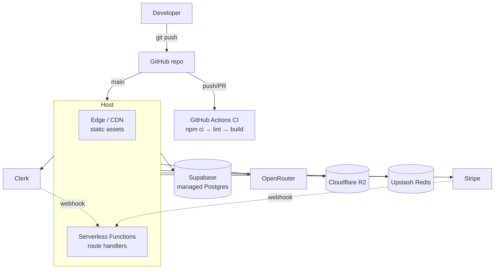

# 02 — System Architecture

> Diagrams use [Mermaid](https://mermaid.js.org/). They render in GitHub, GitLab, VS Code (with a Mermaid extension), and most modern markdown viewers.

---

## 1. Overall Architecture

Lucy is a **single Next.js application** that orchestrates a set of managed third-party services. The Next.js server (route handlers + server components) is the only first-party compute; everything else is SaaS.



**Key principle:** the app server holds the *secrets* and *business logic*; the browser only ever talks to first-party endpoints and Clerk's hosted widgets. The Supabase service-role key, OpenRouter key, Stripe secret, and R2 keys never reach the client.

---

## 2. Frontend Architecture



- **Server state** (data from APIs) → TanStack Query. **Ephemeral UI state** (open panels, current chat draft) → Zustand stores in `src/store/`.
- **Forms** use `react-hook-form` + `zod` resolvers.
- **Styling** is Tailwind v4 with a custom OkLCh theme defined inline in `src/styles/globals.css`; primitives in `components/ui/` follow the shadcn pattern over Radix.

---

## 3. Backend Architecture

The backend is **route handlers + server-only library code**. There is a deliberate layering:



**Three Supabase clients** (`src/lib/supabase/`):
| Client | Key | RLS | Used by |
|---|---|---|---|
| `client.ts` | anon | enforced | browser |
| `server.ts` | anon (+ Clerk JWT) | enforced | server components / user-scoped reads |
| `admin.ts` | service role | **bypassed** | webhooks, admin ops, coin grants |

> **Security note:** the service-role client bypasses RLS entirely. Its use is intentionally confined to webhooks, admin routes, and privileged RPC calls. Any new use should be reviewed.

---

## 4. Database Architecture

Supabase Postgres with **Row-Level Security on every user-owned table**. Ownership is the Clerk user id (`auth.jwt()->>'sub'`). See [05 — Database](05-database-documentation.md) for the full ER diagram and per-table detail.



**Integrity mechanisms:** atomic coin RPCs (`spend_coins`/`grant_coins`), idempotency keys on the ledger, a `coin_balance_check` reconciliation view, and FK `ON DELETE CASCADE` so deleting a profile removes all owned data.

---

## 5. Authentication Flow



Full detail, including session management and RBAC, in [07 — Authentication Flow](07-authentication-flow.md).

---

## 6. AI Request Flow (Chat)

This is the critical path: `POST /api/chat/[id]/messages` (see [src/app/api/chat/[id]/messages/route.ts](../src/app/api/chat/%5Bid%5D/messages/route.ts)).

```mermaid
sequenceDiagram
  participant U as User
  participant API as Chat API
  participant G as Security Guards
  participant Coin as spend_coins RPC
  participant LLM as OpenRouter
  participant DB as Supabase

  U->>API: POST message {content}
  API->>API: auth → rate limit → ensureProfile → ban check
  API->>API: assertCanSendMessage (daily limit)
  API->>G: guardChatInput (moderation + injection)
  alt blocked
    G-->>API: 422; log security event; maybe auto-suspend
    API-->>U: error (no coin spent)
  else allowed
    API->>DB: insert user message
    API->>Coin: spend 1 coin (idempotency=chat:user:msgId)
    API->>DB: load history + memories + summary
    API->>LLM: stream completion (system prompt + history)
    loop streaming
      LLM-->>API: delta
      API-->>U: {type:delta} (NDJSON)
    end
    API->>G: guardOutput (leak + moderation)
    alt unsafe
      G-->>API: replace text with safe fallback
    end
    API->>DB: insert assistant msg, update preview, relationship
    API->>DB: log usage; trackEvent; extract memories (async)
    API-->>U: {type:done}
    note over API,Coin: On any failure → refund coin + delete msg
  end
```

Full detail in [08 — AI System](08-ai-system-documentation.md).

---

## 7. Payment Flow



---

## 8. Deployment Architecture



> **⚠️ Assumption:** No `Dockerfile`, `vercel.json`, or other host manifest is committed. Given Next.js 16 + serverless route handlers + the absence of any container/orchestration config, **Vercel** (or an equivalent Next.js-native serverless platform) is the assumed target. The CI workflow (`.github/workflows/ci.yml`) only lints and builds — it does **not** deploy — so deployment is presumed handled by the host's Git integration. See [11 — Deployment Guide](11-deployment-guide.md).
