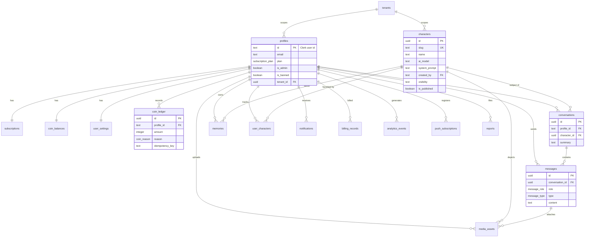

# 05 — Database Documentation

> **Engine:** PostgreSQL via **Supabase**. Schema is defined as version-controlled SQL migrations in [supabase/migrations/](../supabase/migrations/) (`0001_init.sql` … `0017_repair_missing_migrations.sql`). Generated TypeScript types live in [src/types/database.ts](../src/types/database.ts).
>
> **Ownership model:** the primary key of `profiles` is the **Clerk user id** (a `text` value, the JWT `sub` claim). All user-owned tables reference it. RLS scopes every query to `auth.jwt()->>'sub'`.

---

## 1. Enums

| Enum | Values |
|---|---|
| `subscription_plan` | `free`, `premium`, `ultimate` |
| `subscription_status` | `active`, `cancelled`, `past_due`, `trialing` |
| `relationship_status` | `stranger`, `acquaintance`, `friend`, `close`, `partner` |
| `message_role` | `user`, `assistant`, `system` |
| `message_type` | `text`, `voice`, `image`, `system` |
| `memory_type` | `personality`, `relationship`, `semantic`, `episodic` |
| `billing_status` | `paid`, `pending`, `failed` |
| `media_type` | `image`, `video` |
| `coin_reason` | `subscription_grant`, `admin_grant`, `purchase`, `signup_bonus`, `refund`, `spend_text`, `spend_image`, `spend_voice`, `adjustment` |
| `report_status` | `open`, `reviewing`, `resolved`, `dismissed` |

---

## 2. Entity-Relationship Diagram



> **Note:** `is_banned`, `banned_reason`, `visibility`, `created_by`, `tenant_id`, `summary`, `stripe_*` columns are added by later migrations (`0004`, `0015`, and the user-character branch); `0001_init.sql` shows the base shape.

---

## 3. Table Reference

Legend: **PK** primary key · **FK** foreign key · **UK** unique.

### 3.1 `profiles` — user identity (mirror of Clerk)
**Purpose:** one row per Clerk user; the anchor every other user table references.

| Column | Type | Notes |
|---|---|---|
| `id` | text **PK** | Clerk user id (`auth.jwt()->>'sub'`) |
| `email` | text NOT NULL | |
| `username` | text | |
| `avatar_url` | text | |
| `plan` | `subscription_plan` | default `free` (denormalized convenience copy of `subscriptions.plan`) |
| `email_verified` | boolean | default false |
| `is_admin` | boolean | default false — grants admin panel |
| `is_banned` | boolean | (added later) blocks all actions |
| `banned_reason` | text | (added later) |
| `tenant_id` | uuid **FK**→tenants | (added `0015`) |
| `created_at` / `updated_at` | timestamptz | |

**Indexes:** `profiles_email_idx (email)`, `profiles_tenant_idx (tenant_id)`.
**RLS:** select own *or* admin; update own. **Insert/delete only via service role** (Clerk webhook).
**Security implication:** `id` is externally controlled (Clerk). RLS depends on the Clerk JWT being correctly verified by Supabase's third-party auth integration.

### 3.2 `characters` — shared character catalog
**Purpose:** the AI companions — both official (catalog) and user-created (private).

| Column | Type | Notes |
|---|---|---|
| `id` | uuid **PK** | |
| `slug` | text **UK** | URL handle |
| `name` | text NOT NULL | |
| `tagline` / `description` | text | |
| `avatar_url` | text NOT NULL | |
| `gallery_urls` | text[] | |
| `category` | text | |
| `tags` / `personality` | text[] | drive default prompt |
| `voice_preview_url` | text | |
| `is_published` | boolean | default true — gate for public visibility |
| `ai_model` | text | per-character model override |
| `system_prompt` | text | custom prompt (else auto-built) |
| `created_by` | text **FK**→profiles | null = official |
| `visibility` | text | `public` / `private` |
| `tenant_id` | uuid **FK**→tenants | |

**Indexes:** `characters_category_idx`, `characters_tenant_idx`.
**RLS:** readable when `is_published` OR admin; **write = admin only**. (User-created characters are inserted via the service-role/admin path with `created_by` forced to the caller.)
**Security implication:** `system_prompt` is admin-controlled and trusted; user-supplied prompt text is sanitized (`sanitizeUserText`, 4000 chars) before use.

### 3.3 `user_characters` — per-user character state
**Purpose:** the relationship between a user and a character (favorite, closeness, message count).

| Column | Type | Notes |
|---|---|---|
| `profile_id` | text **FK** (cascade) | composite **PK** |
| `character_id` | uuid **FK** (cascade) | composite **PK** |
| `is_favorite` | boolean | |
| `relationship_status` | `relationship_status` | default `stranger` |
| `message_count` | integer | drives relationship progression |

**Index:** `user_characters_profile_idx`. **RLS:** owner-only (or admin).

### 3.4 `conversations` — chat threads
| Column | Type | Notes |
|---|---|---|
| `id` | uuid **PK** | |
| `profile_id` | text **FK** (cascade) | |
| `character_id` | uuid **FK** (restrict) | cannot delete a character with conversations |
| `last_message` / `last_message_at` | text / timestamptz | list preview |
| `summary` | text | rolling summary for long-context prompts (added `0015`) |
| `unread_count` | integer | |
| — | — | **UK** `(profile_id, character_id)` — one thread per pair |

**Index:** `conversations_profile_lastmsg_idx (profile_id, last_message_at desc)`. **RLS:** owner-only/admin.

### 3.5 `messages` — chat messages
| Column | Type | Notes |
|---|---|---|
| `id` | uuid **PK** | |
| `conversation_id` | uuid **FK** (cascade) | |
| `profile_id` | text **FK** (cascade) | |
| `role` | `message_role` | user / assistant / system |
| `type` | `message_type` | text / voice / image / system |
| `content` | text | |
| `media_url` | text | image/voice URL |
| `duration` | integer | voice seconds |

**Indexes:** `messages_conversation_created_idx (conversation_id, created_at)`, `messages_profile_idx`. **RLS:** owner-only/admin.
**Security implication:** assistant `content` is the AI output *after* the output guard; user `content` is stored after moderation passes.

### 3.6 `memories` — long-term memory
| Column | Type | Notes |
|---|---|---|
| `id` | uuid **PK** | |
| `profile_id` | text **FK** (cascade) | |
| `character_id` | uuid **FK** (cascade, nullable) | global if null |
| `type` | `memory_type` | |
| `title` / `content` | text | |
| `is_pinned` | boolean | |

**Index:** `memories_profile_idx`. **RLS:** owner-only/admin.
**Privacy note:** memory writing is gated by `user_settings.privacy_store_memory`; incognito users do not generate memories.

### 3.7 `user_settings` — preferences (1:1)
| Column | Type | Default |
|---|---|---|
| `profile_id` | text **PK FK** | |
| `response_length` | text | `medium` |
| `creativity` | integer | 50 |
| `privacy_incognito` | boolean | false |
| `privacy_store_memory` | boolean | true |
| `notify_email` / `notify_push` / `notify_marketing` | boolean | true/true/false |
| `extra` | jsonb | `{}` (stores `onboarding_completed`, first character slug, etc.) |

**RLS:** owner-only/admin.

### 3.8 `subscriptions` — billing state (1:1)
| Column | Type | Notes |
|---|---|---|
| `profile_id` | text **PK FK** | |
| `plan` | `subscription_plan` | |
| `status` | `subscription_status` | |
| `current_period_end` | timestamptz | |
| `cancel_at_period_end` | boolean | |
| `monthly_coin_allowance` | integer | coins granted each period |
| `external_ref` | text | legacy |
| `stripe_customer_id` | text | **UK** (added `0015`) |
| `stripe_subscription_id` | text | **UK** (added `0015`) |

**Indexes:** unique partial indexes on the two stripe ids. **RLS:** select own/admin; **writes via service role / RPC only** (webhook).

### 3.9 `coin_balances` — cached balance (1:1)
| Column | Type | Notes |
|---|---|---|
| `profile_id` | text **PK FK** | |
| `balance` | integer | **CHECK ≥ 0** |

**RLS:** select own/admin; writes only through `spend_coins`/`grant_coins`.

### 3.10 `coin_ledger` — immutable transaction log
| Column | Type | Notes |
|---|---|---|
| `id` | uuid **PK** | |
| `profile_id` | text **FK** (cascade) | |
| `amount` | integer | **CHECK ≠ 0**; + = credit, − = debit |
| `reason` | `coin_reason` | |
| `balance_after` | integer | running balance |
| `metadata` | jsonb | context (action type, character, invoice) |
| `idempotency_key` | text | dedupe |

**Indexes:** `coin_ledger_profile_created_idx`, **unique** `coin_ledger_idem_idx (profile_id, idempotency_key)` where key not null. **RLS:** select own/admin.
**Integrity:** view `coin_balance_check` reports `cached_balance − ledger_sum` drift (should always be 0).

### 3.11 `action_costs` — coin price list
| Column | Type | Seed |
|---|---|---|
| `action_type` | text **PK** | `text`=1, `image`=20, `voice_minute`=10 |
| `cost` | integer | **CHECK ≥ 0** |

**RLS:** readable by all; admin write.

### 3.12 `media_assets` — uploaded/generated media
| Column | Type | Notes |
|---|---|---|
| `id` | uuid **PK** | |
| `profile_id` | text **FK** (cascade) | |
| `provider` / `bucket` / `path` / `url` | text | R2 location |
| `type` | `media_type` | image/video |
| `message_id` | uuid **FK**→messages (set null) | |
| `character_id` | uuid **FK**→characters (set null) | |
| `size_bytes` | bigint | |

**Indexes:** `media_assets_profile_idx`, `media_assets_message_idx`. **RLS:** owner-only/admin.

### 3.13 `notifications`
| Column | Type | Notes |
|---|---|---|
| `id` | uuid **PK** | |
| `profile_id` | text **FK** (cascade) | |
| `title` / `body` / `href` | text | |
| `read` | boolean | |

**Index:** `notifications_profile_read_idx (profile_id, read, created_at desc)`. **RLS:** select + mark-read by owner; create via service role.

### 3.14 `billing_records` — invoice history
| Column | Type | Notes |
|---|---|---|
| `id` | uuid **PK** | |
| `profile_id` | text **FK** (cascade) | |
| `amount` | numeric(12,2) | |
| `currency` | text | default `usd` |
| `status` | `billing_status` | |
| `invoice_url` | text | Stripe hosted invoice |
| `external_ref` | text | Stripe invoice id — **UK** (idempotency) |

**Indexes:** `billing_records_profile_idx`, unique `billing_records_external_ref_idx`. **RLS:** owner+admin read; admin write.

### 3.15 `reports` — content reports
| Column | Type | Notes |
|---|---|---|
| `id` | uuid **PK** | |
| `reporter_id` | text **FK**→profiles (set null) | |
| `character_id` / `conversation_id` | uuid **FK** (set null) | |
| `category` / `reason` | text | |
| `status` | `report_status` | default `open` |

**Indexes:** `reports_status_idx`, `reports_created_idx`.

### 3.16 `app_settings` — feature flags + economy config
| Column | Type | Notes |
|---|---|---|
| `key` | text **PK** | e.g. `user_created_characters`, `image_generation`, `voice_calls_beta`, economy keys |
| `value` | jsonb | boolean flag or numeric config |

Read via `lib/data/app-settings.ts` / `economy-settings.ts`; written by admin settings API.

### 3.17 `tenants` — white-label
| Column | Type | Notes |
|---|---|---|
| `id` | uuid **PK** | |
| `slug` | text **UK** NOT NULL | seed: `lucy` |
| `name` / `brand_name` | text | |
| `logo_url` | text | |
| `primary_color` | text | default `#7c3aed` |
| `domain` | text | custom domain |
| `is_active` | boolean | |

### 3.18 `analytics_events` — product analytics
| Column | Type | Notes |
|---|---|---|
| `id` | uuid **PK** | |
| `profile_id` | text **FK** (set null) | |
| `event` | text | `signup`, `message_sent`, `upgrade_started/completed`, … |
| `metadata` | jsonb | |

**Indexes:** `analytics_events_event_created_idx`, `analytics_events_profile_idx`.

### 3.19 `push_subscriptions` — web push
| Column | Type | Notes |
|---|---|---|
| `id` | uuid **PK** | |
| `profile_id` | text **FK** (cascade) | |
| `endpoint` / `p256dh` / `auth` | text | Web Push keys |
| — | — | **UK** `(profile_id, endpoint)` |

---

## 4. Row-Level Security (RLS)

Defined in `0002_rls.sql` (base) and `0016_rls_v2_tables.sql` (v2 tables). Two helper functions:

```sql
current_profile_id() -- returns auth.jwt()->>'sub'
is_admin()           -- returns (auth.jwt()->'metadata'->>'role') = 'admin'
```

**Policy patterns:**
| Pattern | Tables |
|---|---|
| **Owner-only (read+write)** | `user_characters`, `conversations`, `messages`, `memories`, `user_settings`, `media_assets` |
| **Owner read / RPC-or-service write** | `subscriptions`, `coin_balances`, `coin_ledger` |
| **Owner read + owner mark-read** | `notifications` |
| **World-readable (published) / admin write** | `characters` |
| **All-read / admin-write** | `action_costs` |
| **Owner+admin read / admin write** | `billing_records` |

**Critical security properties**
- The **service-role client bypasses RLS entirely** — used only by webhooks, admin routes, and `SECURITY DEFINER` RPCs.
- `spend_coins`/`grant_coins` are `SECURITY DEFINER` so they can write coin tables despite RLS, but they **pin the actor** to the JWT `sub` (spend) or require admin/service role (grant).
- Admin reads rely on the **Clerk session claim** `metadata.role = 'admin'` being present in the JWT Supabase verifies — keep the JWT template and `is_admin` flag in sync.

---

## 5. Database Functions (`0003_functions.sql`, `0015`)

| Function | Purpose | Security |
|---|---|---|
| `spend_coins(amount, reason, metadata, idem_key)` | Atomic debit with `FOR UPDATE` lock, balance ≥ amount check, idempotency replay-safe | `SECURITY DEFINER`, granted to `authenticated`; actor = JWT sub |
| `grant_coins(profile_id, amount, reason, metadata, idem_key)` | Atomic credit (upsert balance + ledger) | `SECURITY DEFINER`, granted to `authenticated`+`service_role`; requires admin unless service role |
| `count_user_messages_today(profile_id)` | Daily message count for plan limits | `SECURITY DEFINER`, stable |
| `coin_balance_check` (view) | Drift = cached balance − ledger sum | — |

---

## 6. Migration History

There are **22 migrations** in [supabase/migrations/](../supabase/migrations/) (`0001` … `0022`):

| Migration | Adds |
|---|---|
| `0001_init.sql` | Base tables, enums, indexes |
| `0002_rls.sql` | RLS helpers (`current_profile_id`, `is_admin`) + policies |
| `0003_functions.sql` | Coin RPCs (`spend_coins`/`grant_coins`) + reconciliation view |
| `0004_security_hardening.sql` | Additional security rules |
| `0005_seed_characters.sql` | Default character catalog |
| `0006_messages_rls_hardening.sql` | Tighter message RLS |
| `0007_character_ai_model.sql` | `characters.ai_model` |
| `0008_character_config_and_ownership.sql` | `system_prompt`, `created_by`, `visibility` |
| `0009_ai_usage_log.sql` | AI usage logging table |
| `0010_chat_privacy_hardening.sql` | Chat privacy controls |
| `0011_reports.sql` | `reports` table + `report_status` enum |
| `0012_app_settings.sql` | `app_settings` (flags + economy) |
| `0013_character_filters.sql` | Character filtering support |
| `0014_profile_ban.sql` | `is_banned` / `banned_reason` |
| `0015_v2_platform.sql` | Stripe ids, `summary`, `tenants`, `analytics_events`, `push_subscriptions`, daily-message fn |
| `0016_rls_v2_tables.sql` | RLS for v2 tables |
| `0017_repair_missing_migrations.sql` | Schema repairs |
| `0018_profiles_column_guard.sql` | Profile column guards |
| `0019_count_messages_hardening.sql` | Daily-count fn hardening |
| `0020_performance_indexes.sql` | Additional performance indexes |
| `0021_admin_usage_aggregates.sql` | Admin usage aggregate support |
| `0022_security_events.sql` | Security event log table (abuse/audit) |

> **Note:** the `security_events` table (referenced by `lib/security/audit.ts` for abuse auto-suspend) is created in `0022`. The AI-usage log (`0009`) backs the `/admin/usage` views.

---

## 7. Data-Handling Best Practices

- **Never write coins directly** — always go through the RPCs (preserves the ledger + idempotency).
- **Deleting a profile** cascades to all owned rows; deleting a *character* with conversations is **blocked** (`ON DELETE RESTRICT`) — unpublish instead.
- **Regenerate types** (`src/types/database.ts`) after any migration.
- **Back up before destructive migrations** (see [16 — Business Continuity](16-business-continuity-guide.md)).
