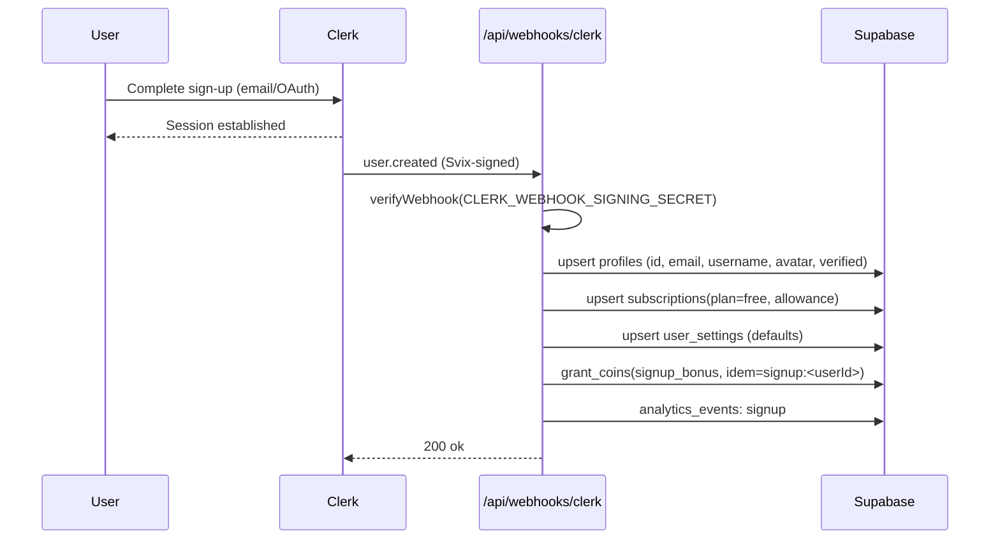
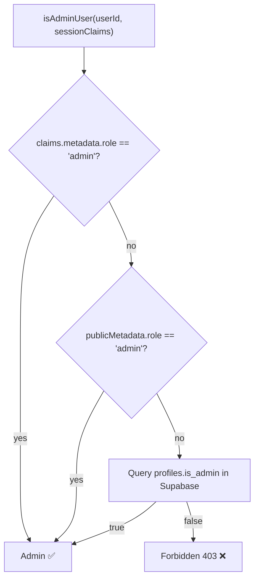
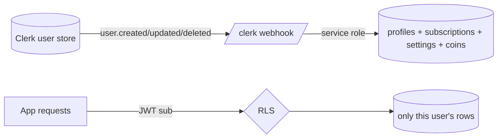

# 07 — Authentication & Authorization

> **Identity provider:** [Clerk](https://clerk.com). **Authorization store:** Supabase (RLS + `profiles.is_admin` / `is_banned`).
> Lucy delegates *authentication* (proving who you are) entirely to Clerk and implements *authorization* (what you may do) itself.

---

## 1. Roles & Responsibilities

| System | Owns |
|---|---|
| **Clerk** | Sign-up, sign-in, sign-out, sessions, OAuth, password reset, MFA, the user record, the JWT |
| **Lucy app** | Mapping a Clerk user → a `profiles` row, plan/coin state, admin/ban flags, per-request gates |
| **Supabase** | Verifying the Clerk JWT and enforcing Row-Level Security keyed to `sub` |

---

## 2. Signup



- The Clerk webhook is the **single bootstrap point** for a new user's backend state. It uses the **service-role** Supabase client (RLS bypassed) and is **idempotent** (upserts + a `signup:<userId>` idempotency key on the coin grant).
- A safety net exists: `ensureProfile()` ([src/lib/ensure-profile.ts](../src/lib/ensure-profile.ts)) lazily creates the profile on the first authenticated API call, in case the webhook is delayed or missed.

---

## 3. Login

1. User authenticates through Clerk's hosted pages ([src/app/sign-in/[[...sign-in]]/page.tsx](../src/app/sign-in/%5B%5B...sign-in%5D%5D/page.tsx)).
2. Clerk issues a **session JWT**. The app reads it server-side via `auth()`:
   ```ts
   const { userId, sessionClaims } = await auth();
   ```
3. The same JWT is presented to Supabase, whose RLS helpers (`current_profile_id()`, `is_admin()`) read its claims.

> **JWT template:** for RLS and admin checks to work, the Clerk session token must expose `sub` (always present) and `metadata.role`. This is configured in the Clerk dashboard's JWT/session-token customization. See [15 — Rebuild Guide](15-rebuild-from-scratch-guide.md).

---

## 4. Logout & Session Management

- **Sessions** are managed entirely by Clerk (token issuance, refresh, revocation). Lucy stores no session state of its own.
- **Logout** clears the Clerk session client-side; subsequent server calls see no `userId` and return `401`.
- **Session lifetime / inactivity / multi-device** are governed by Clerk dashboard settings, not application code.

---

## 5. OAuth & Password Reset

- **OAuth providers** (Google, etc.) and **password reset** are handled on Clerk's hosted pages and configured in the Clerk dashboard — there is no app-side code for them.
- Whatever providers are enabled in Clerk automatically appear on the sign-in/up pages.

> **⚠️ Assumption:** specific OAuth providers (Google, Apple, etc.) are a Clerk-dashboard configuration not visible in the repo. Enable per business preference.

---

## 6. Authorization Model

### 6.1 The three gates
Implemented in [src/lib/auth/](../src/lib/auth/):

| Gate | Function | Used where |
|---|---|---|
| **Authenticated** | `auth()` → `userId` | every protected route/page |
| **Admin** | `isAdminRequest()` → `isAdminUser(userId, claims)` | every `/api/admin/*` route + `(admin)/layout.tsx` |
| **Not banned** | `ensureNotBanned()` / `bannedResponse()` | all user write/chat routes |

### 6.2 Admin resolution


- The **fast path** is the JWT claim (no DB hit). The DB `is_admin` flag is the fallback / source of truth synced by the Clerk webhook from `public_metadata.role`.
- **Defense in depth:** even though the `is_admin()` SQL helper enforces admin reads at the RLS layer, every admin *route* also calls `isAdminRequest()`.

### 6.3 Bans
- `profiles.is_banned = true` → `bannedResponse()` returns **403** before any write.
- Bans are set by admins (`PATCH /api/admin/users/[id]` with `ban`) **or automatically** by the abuse system: `autoSuspendForAbuse()` triggers after `ABUSE_SUSPEND_THRESHOLD` security violations ([src/lib/security/audit.ts](../src/lib/security/audit.ts)).

### 6.4 Plan-based access
Beyond identity, **plan** controls feature access (see [src/lib/plan-limits.ts](../src/lib/plan-limits.ts)):
| Capability | Free | Premium | Ultimate |
|---|---|---|---|
| Daily messages | 30 | ∞ | ∞ |
| Active characters | 1 | 3 | ∞ |
| Voice | ✗ | ✓ | ✓ |
| Image gen | ✗ | ✗ | ✓ |

---

## 7. Clerk ⇄ Supabase Sync



- **Source of truth for identity = Clerk.** Source of truth for app state = Supabase, kept in sync by the webhook.
- **Role changes** must be made in Clerk (`public_metadata.role = 'admin'`); the next `user.updated` webhook propagates `is_admin`.

---

## 8. Security Notes & Best Practices

- ✅ App never handles passwords — eliminates a whole class of credential risk.
- ✅ RLS means even a leaked anon key cannot read other users' data.
- ⚠️ **Webhook routes must be excluded from Clerk auth middleware** — they authenticate via signature, not session. Confirm this in middleware/route matchers before deploy.
- ⚠️ **Service-role key is god-mode** — any leak bypasses all RLS. Keep it server-only (`server-only` import guard) and rotate on suspicion.
- ⚠️ Keep the **Clerk JWT template** (`metadata.role`) and the **`is_admin` flag** consistent; a mismatch can grant or deny admin unexpectedly.
- ✅ `ensureProfile()` makes the app resilient to a missed signup webhook.

### Common mistakes
- Forgetting `isAdminRequest()` on a new admin route → privilege escalation.
- Adding a new user-write route without `bannedResponse()` → banned users can still act.
- Querying with the service-role client for user-scoped reads → silently bypasses RLS ownership.
