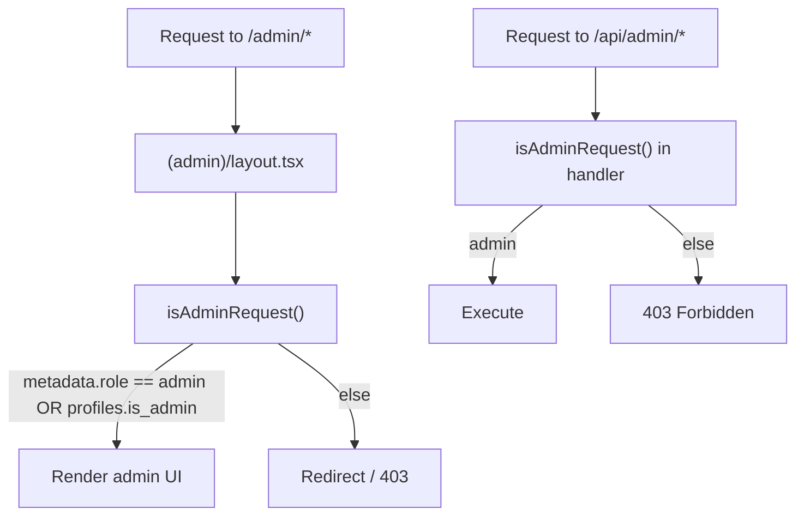

# 09 — Admin Panel Documentation

> The admin panel lives under [src/app/(admin)/admin/](../src/app/(admin)/admin/) and is backed by the `/api/admin/*` endpoints ([06 — API §8](06-api-documentation.md)). It is the operator's control room: catalog, economy, moderation, and analytics.

---

## 1. Access Control

- **Two independent gates:** the route group layout (`(admin)/layout.tsx`) gates the **UI**, and every `/api/admin/*` handler independently calls `isAdminRequest()` to gate the **data**. Both are required.
- Admin status = Clerk session claim `metadata.role == 'admin'` **or** `profiles.is_admin == true` (see [07 — Auth §6.2](07-authentication-flow.md)).
- Admin endpoints use the **service-role** Supabase client and therefore **bypass RLS** — authorization is the sole protection.

---

## 2. Admin Pages

| Page | Route | Backing API | What it does |
|---|---|---|---|
| **Dashboard** | `/admin` | `/api/admin/stats` | KPIs: users, revenue, messages, storage; top characters |
| **Users** | `/admin/users` | `/api/admin/users` | Search + paginate all users with stats |
| **User detail** | `/admin/users/[id]` | `/api/admin/users/[id]` (GET/PATCH) | View a user; change plan, grant coins, ban/unban |
| **Characters** | `/admin/characters` | `/api/admin/characters` (+`/[id]`) | Create/edit/delete the official catalog (incl. unpublished) |
| **AI Models** | `/admin/ai-models` | `/api/admin/ai-models` (+`/test`) | Manage allow-list + default model; test a model live |
| **Settings** | `/admin/settings` | `/api/admin/settings` | Toggle feature flags + edit coin economy values |
| **Payments** | `/admin/payments` | `/api/admin/payments` | Paginated billing records / invoices |
| **Usage** | `/admin/usage` | `/api/admin/usage` | AI token usage by model & character; popularity |
| **Subscriptions** | `/admin/subscriptions` | `/api/admin/subscriptions` | Plan breakdown + MRR |
| **Cohorts** | `/admin/cohorts` | `/api/admin/cohorts` | Signup cohorts, D1/D7/D30 retention, conversion funnel |
| **Reports** | `/admin/reports` | `/api/admin/reports` (+`/[id]`) | Triage content reports; change status |
| **Memories** | `/admin/memories` | `/api/admin/memories` | Platform-wide memory overview |
| **Storage** | `/admin/storage` | `/api/admin/media` (+`/[id]`, `/upload`) | R2 file browser: list, filter, platform upload, delete |
| **Tenants** | `/admin/tenants` | (tenants data) | White-label brand instances |
| **Unit economics** | (within usage/dashboard) | `/api/admin/unit-economics` | Margin by plan, top spenders |

> **⚠️ Assumption:** "Unit economics" is exposed via the API and likely surfaced within the Usage or Dashboard pages rather than its own nav item; verify against the live nav (`src/constants/routes.ts`).

---

## 3. Capabilities In Detail

### 3.1 User management (`/admin/users`)
- **Search & paginate** all profiles with derived stats.
- `PATCH /api/admin/users/[id]` supports: `plan` change (overrides subscription), `grantCoins` (calls `grant_coins`), `ban` with reason, `unban`.
- Banning sets `profiles.is_banned` → the user is immediately blocked from all write/chat actions.

### 3.2 Character management (`/admin/characters`)
- Full CRUD over the catalog. Admins can set **public visibility**, **per-character AI model**, and **custom system prompt** — fields ordinary users cannot.
- Delete cascades related rows (note: a character with conversations is normally `ON DELETE RESTRICT`; admin delete handles cleanup — verify cascade behavior before bulk deletes).

### 3.3 AI model governance (`/admin/ai-models`)
- Pull the live OpenRouter catalog, choose which models are **user-allowed**, set the **platform default**, and **test** a model with a sample prompt before enabling it.
- This is the lever that controls **cost vs. quality** across the whole platform.

### 3.4 Economy & feature flags (`/admin/settings`)
- **Feature flags** (`app_settings`): e.g. `user_created_characters`, `image_generation`, `voice_calls_beta` — toggled without a deploy.
- **Economy values:** signup bonus, per-plan allowances, action costs — read by `economy-settings.ts` and override the code defaults in `coins-config.ts`.

### 3.5 Financial & growth analytics
- **Payments / Subscriptions:** revenue, MRR, plan mix.
- **Usage / Unit economics:** token spend and cost per model/character/plan → margin.
- **Cohorts:** retention and funnel — the core growth dashboard.

### 3.6 Moderation (`/admin/reports`)
- Review user-filed reports, transition status (`open → reviewing → resolved/dismissed`), and act on offending characters/users.

---

## 4. Operational Notes & Best Practices

- **Admin actions are powerful and RLS-free** — log and review them. Granting coins, changing plans, and bans are all auditable through `coin_ledger`, `subscriptions`, and `profiles` history, but there is no dedicated admin audit trail beyond the security event log.
- **Promote an admin** by setting `public_metadata.role = 'admin'` in Clerk (propagates to `is_admin` via the `user.updated` webhook), not by editing the DB directly — otherwise the JWT fast-path won't reflect it.
- **Economy changes take effect immediately** for new actions — change coin costs carefully; they affect live spend.
- **Test models before allow-listing** — an expensive or unreliable model added to the allow-list affects all users and margins.

### Common mistakes
- Editing `profiles.is_admin` directly in SQL but not Clerk metadata → inconsistent admin state.
- Deleting characters that have active conversations without understanding cascade implications.
- Toggling `image_generation`/`voice_calls_beta` on before the underlying feature is production-ready.
