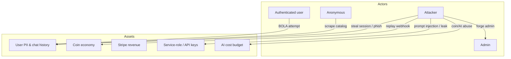
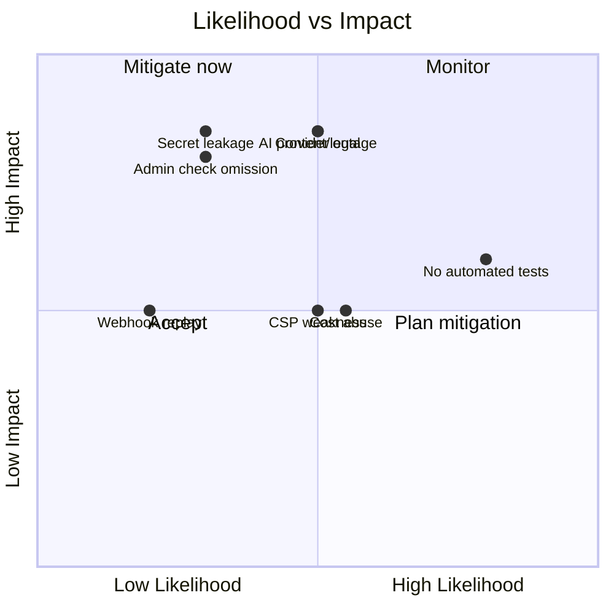

# 10 — Security Documentation

> A security audit of Lucy against OWASP Top 10 (2021), the OWASP API Security Top 10 (2023), authentication and AI-specific best practices, plus a threat model, risk matrix, checklist, and recommended fixes.
>
> **Scope note:** this is a documentation-time review based on source inspection, not a penetration test. Findings marked **⚠️** are inferred.

---

## 1. Security Posture Summary

Lucy has a **strong security foundation** for its stage: RLS on every user table, atomic/idempotent money handling, signature-verified webhooks, a deliberate AI-safety pipeline, strict transport/headers, and an abuse auto-suspend system. The main weaknesses are a **content-security-policy that allows `unsafe-inline`/`unsafe-eval`**, **secret sprawl** across six vendors, **no automated security testing**, and **content/legal exposure** inherent to an adult-companion product.

**Overall security grade: B / 7.5 of 10.**

---

## 2. OWASP Top 10 (2021) Audit

| # | Category | Status | Evidence / Notes |
|---|---|---|---|
| A01 | **Broken Access Control** | 🟢 Strong | RLS keyed to Clerk `sub` on all user tables; ownership re-checked in handlers; admin double-gated (layout + per-route `isAdminRequest`). ⚠️ Risk: a future admin route forgetting the check. |
| A02 | **Cryptographic Failures** | 🟢 Good | TLS enforced via HSTS (2yr, preload). No passwords stored (Clerk). Secrets in env, not code. |
| A03 | **Injection** | 🟢 Good | Supabase client uses parameterized queries; Zod validates inputs; prompt-injection filtered. ⚠️ Verify no raw SQL string-building in any `lib/data` module. |
| A04 | **Insecure Design** | 🟢 Good | Coins atomic+idempotent; spend-before-call with refund; input guard before persistence. |
| A05 | **Security Misconfiguration** | 🟡 Medium | CSP allows `unsafe-inline` + `unsafe-eval`; placeholder image CDNs (`unsplash`, `picsum`) still allowed. `BILLING_DEV_BYPASS` must be off in prod. |
| A06 | **Vulnerable / Outdated Components** | 🟡 Medium | Modern deps, but **no automated dependency scanning** (Dependabot/`npm audit` in CI) found. |
| A07 | **Identification & Auth Failures** | 🟢 Strong | Delegated to Clerk (sessions, MFA-capable, OAuth). App holds no credentials. |
| A08 | **Software & Data Integrity** | 🟡 Medium | Webhooks signature-verified + idempotent. ⚠️ No CI artifact signing / SLSA; lockfile present but no supply-chain scanning. |
| A09 | **Logging & Monitoring Failures** | 🟡 Medium | Security events logged (`logSecurityEvent`) + analytics; but relies on `console.*` + platform logs, **no error tracking/alerting (Sentry-class)**. |
| A10 | **SSRF** | 🟢 Low risk | Outbound calls go to fixed vendor hosts; user input doesn't drive arbitrary URLs (image URL handling should be confirmed). |

---

## 3. OWASP API Security Top 10 (2023) Audit

| # | Category | Status | Notes |
|---|---|---|---|
| API1 | Broken Object Level Auth (BOLA) | 🟢 | Resources fetched as `getX(id, userId)`; RLS backstop. |
| API2 | Broken Authentication | 🟢 | Clerk JWT verified server-side & by Supabase. |
| API3 | Broken Object Property Level Auth | 🟢 | Client-supplied `profile_id`/`createdBy`/`reporter_id` always overwritten server-side. |
| API4 | Unrestricted Resource Consumption | 🟡 | Rate limits + coin gating + token caps + upload size cap (10MB). ⚠️ Memory-extraction & image gen could be abused; no per-cost circuit breaker. |
| API5 | Broken Function Level Auth | 🟢 | Admin routes individually gated. |
| API6 | Unrestricted Access to Sensitive Business Flows | 🟡 | Login-bonus & signup-bonus idempotent; ⚠️ ensure no replay path grants coins twice. |
| API7 | SSRF | 🟢 | See A10. |
| API8 | Security Misconfiguration | 🟡 | CSP weakening (see A05). |
| API9 | Improper Inventory Management | 🟡 | No formal API versioning/inventory; this doc partly addresses it. |
| API10 | Unsafe Consumption of 3rd-Party APIs | 🟡 | OpenRouter output passes through `guardOutput`; ⚠️ no schema validation of provider responses beyond defensive parsing. |

---

## 4. Authentication Best Practices

| Practice | Status |
|---|---|
| No passwords stored in-app | ✅ (Clerk) |
| MFA available | ✅ (Clerk dashboard) |
| Session expiry / revocation | ✅ (Clerk) |
| Least-privilege keys | 🟡 service-role used in several places — review scope |
| Webhook signature verification | ✅ (Svix + Stripe) |
| Admin RBAC | ✅ dual-gated |

---

## 5. AI Security Best Practices

| Control | Status | Where |
|---|---|---|
| System-prompt protection | ✅ `SAFETY_RULES` forbid revealing the prompt | `prompt-safety.ts` |
| Prompt-injection detection | 🟡 pattern-based (baseline) | `security/injection.ts` |
| Treat user/memory as data not instructions | ✅ `<user_memories>` framing | `prompt-safety.ts` |
| Input moderation pre-spend | ✅ | chat route |
| Output leak guard | ✅ `guardOutput` vs system prompt | `security/output-guard.ts` |
| Output moderation | ✅ replace-with-fallback | chat route |
| Abuse auto-suspend | ✅ threshold-based ban | `security/audit.ts` |
| Token/cost caps | ✅ `max_tokens 300`, coin gating | `character-chat.ts` |

> **Recommendation:** pattern-based injection detection is bypassable. For higher assurance, add an LLM-based moderation/injection classifier and a structured-output validator for provider responses.

---

## 6. Threat Model

| Threat | Vector | Mitigation | Residual |
|---|---|---|---|
| Cross-user data access | Guessing ids / token theft | RLS + ownership checks | Low |
| Webhook replay → free coins | Re-POST signed payload | Idempotency keys + signature | Low |
| System-prompt leak | Prompt injection | Safety rules + output guard | Low–Med (pattern-based) |
| Coin/AI cost abuse | Scripted requests | Rate limits + coin gating + token caps | Med (no cost circuit breaker) |
| Admin privilege escalation | Missing route check | Dual gate; ⚠️ depends on discipline | Med |
| Secret leakage | Misconfigured env / log | `server-only`, env-only secrets | Med (6 vendors) |
| XSS | Injected script | Headers + React escaping; ⚠️ CSP `unsafe-*` | Med |
| Content/legal exposure | Disallowed generated content | Moderation pipeline | Med–High (domain risk) |

---

## 7. Risk Matrix

---

## 8. Security Checklist (pre-production)

- [ ] `BILLING_DEV_BYPASS` is unset/false in production.
- [ ] Upstash configured in prod (else rate-limited routes return 503).
- [ ] All `/api/admin/*` routes call `isAdminRequest()` (grep-verify on every release).
- [ ] Webhook routes excluded from Clerk auth middleware; signatures verified.
- [ ] Service-role key only imported in `server-only` modules; never client-reachable.
- [ ] CSP tightened: remove `unsafe-eval`, scope `unsafe-inline` (nonces), drop `unsplash`/`picsum`.
- [ ] Dependency scanning enabled (`npm audit` / Dependabot in CI).
- [ ] Error tracking + alerting integrated (e.g. Sentry).
- [ ] Secrets stored in host secret manager, not committed; rotation runbook exists.
- [ ] Content moderation reviewed against legal requirements for the target jurisdictions.
- [ ] Backups + restore drill verified ([16](16-business-continuity-guide.md)).
- [ ] Coin reconciliation view (`coin_balance_check`) monitored for non-zero drift.

---

## 9. Recommended Fixes (prioritized)

| Priority | Fix | Effort |
|---|---|---|
| **P0** | Add error tracking + alerting; structured logs | Low |
| **P0** | Enable dependency/supply-chain scanning in CI | Low |
| **P0** | Verify webhook exclusion from auth middleware | Low |
| **P1** | Tighten CSP (nonces; drop `unsafe-eval` + placeholder CDNs) | Med |
| **P1** | LLM-based moderation/injection classifier | Med |
| **P1** | Per-user cost circuit breaker (daily $ cap) | Med |
| **P1** | Least-privilege review of service-role usage | Med |
| **P2** | Admin action audit trail | Med |
| **P2** | Legal/compliance review for adult content + age verification | High |
| **P2** | Secret rotation automation | Med |

---

## 10. Performance & Security Notes

- Security headers are global (`next.config.ts` `headers()` on `/(.*)`).
- `Permissions-Policy` already disables camera/geolocation and scopes microphone to self (for voice).
- `frame-ancestors 'none'` + `X-Frame-Options: DENY` prevent clickjacking.
- The coin reconciliation view is both an **integrity** and a **fraud-detection** tool — monitor drift.
