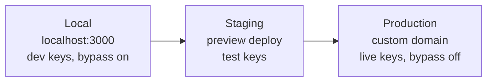
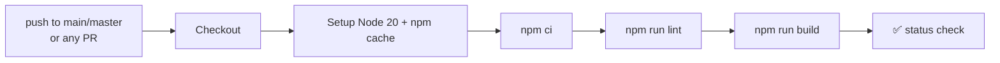
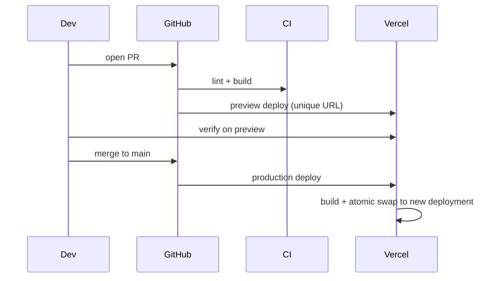

# 11 — Deployment Guide

> Covers local, staging, and production environments, the CI pipeline, deployment, rollback, and backups.
>
> **⚠️ Assumption:** No host manifest (`Dockerfile`, `vercel.json`) is committed. Given Next.js 16 + serverless route handlers, **Vercel** (or an equivalent Next-native platform — Netlify, Cloudflare-Next, AWS Amplify) is the assumed production host. Instructions are written for Vercel and noted where host-specific.

---

## 1. Prerequisites

| Tool / account | Why |
|---|---|
| Node.js 20+ | CI uses Node 20; match locally |
| npm | lockfile is `package-lock.json` |
| Supabase project + CLI | database + migrations |
| Clerk application | auth |
| Stripe account | billing |
| OpenRouter account | LLM |
| Cloudflare R2 bucket | storage |
| Upstash Redis | rate limiting (prod) |
| (optional) OpenAI | TTS |

All required environment variables are documented in [17 — Environment Variables](17-environment-variables.md).

---

## 2. Local Development

```bash
# 1. Install
npm ci

# 2. Configure env
cp .env.example .env.local
#   fill in Clerk, Supabase, OpenRouter at minimum
#   (Stripe/R2/Upstash/OpenAI optional in dev)

# 3. Apply database migrations to your Supabase project
supabase db push          # or apply supabase/migrations/*.sql via the SQL editor

# 4. Run
npm run dev               # Next.js + Turbopack on http://localhost:3000
```

Dev conveniences:
- **`BILLING_DEV_BYPASS`** defaults to enabled in non-production — upgrades skip Stripe and sync directly.
- **Upstash optional** in dev — rate limiters no-op when unset (in prod they 503 if missing).
- **Webhooks locally:** use the Stripe CLI (`stripe listen --forward-to localhost:3000/api/webhooks/stripe`) and Clerk's webhook tunneling to test event flows.

---

## 3. Environments



| Concern | Local | Staging | Production |
|---|---|---|---|
| Clerk | dev instance | test/preview instance | live instance |
| Supabase | dev project | staging project | prod project |
| Stripe | test mode | test mode | **live mode** |
| OpenRouter | shared/free model | real | real |
| Upstash | optional | recommended | **required** |
| `BILLING_DEV_BYPASS` | true | true (or test Stripe) | **false/unset** |
| `NODE_ENV` | development | production | production |

> **⚠️ Assumption / Recommendation:** No staging environment is defined in-repo. Use the host's **preview deployments** (one per PR) pointed at a separate Supabase/Clerk *test* project as staging. This is the single biggest deployment-safety improvement to make.

---

## 4. CI/CD Pipeline

Defined in [.github/workflows/ci.yml](../.github/workflows/ci.yml):



- CI **validates** (lint + build) but does **not deploy**. Deployment is presumed handled by the host's Git integration (push to `main` → production; PR → preview).
- **Gaps to close:** no test step (none exist), no `npm audit`, no type-check beyond build, no deploy/rollback automation in-repo.

---

## 5. Deployment Workflow (Vercel-class)



**Production deploy checklist:**
1. All env vars set in host project settings (production scope).
2. DB migrations applied to the **prod** Supabase project *before* the code that needs them.
3. Clerk + Stripe webhooks point at the production domain; secrets match.
4. `BILLING_DEV_BYPASS` off; Upstash configured.
5. Merge to `main` → host builds & promotes.

---

## 6. Rollback Procedure

| Scenario | Action |
|---|---|
| Bad code deploy | **Vercel:** instant "Promote previous deployment" (atomic, no rebuild). Or revert the commit and push. |
| Bad DB migration | Apply a **down/repair migration** (the repo already uses repair migrations, e.g. `0017`). Postgres has no automatic rollback once applied — restore from PITR backup if data was lost. |
| Bad env/secret | Update in host settings → redeploy (or instant rollback to previous deployment that used old values). |
| Compromised secret | Rotate at the vendor, update host env, redeploy; see [16](16-business-continuity-guide.md). |

> **Golden rule:** code rollback is instant; **database rollback is not** — always back up before destructive migrations and prefer additive, reversible migrations.

---

## 7. Backup Strategy

| Asset | Backup mechanism | Owner |
|---|---|---|
| **Postgres data** | Supabase automated backups + Point-in-Time Recovery (PITR on paid tiers) | Supabase |
| **Schema** | Versioned in `supabase/migrations/` (Git) | Repo |
| **Media (R2)** | R2 durability; ⚠️ enable bucket versioning / lifecycle | Cloudflare |
| **Secrets** | Host secret store; ⚠️ keep an encrypted offline copy | Ops |
| **Code** | Git remote | GitHub |

**Recommendations:**
- Confirm Supabase plan includes **PITR**; document the retention window.
- Schedule periodic **logical dumps** (`pg_dump`) to independent storage for vendor-failure resilience.
- Enable **R2 object versioning** so deleted/overwritten media is recoverable.
- **Run a restore drill** at least quarterly (see [16](16-business-continuity-guide.md)) — an untested backup is not a backup.

---

## 8. Database Migration Workflow

```bash
# create a new migration
supabase migration new <name>      # adds supabase/migrations/00NN_<name>.sql
# write SQL (prefer additive + reversible)
# apply to a target project
supabase db push
# regenerate TS types
supabase gen types typescript --project-id <ref> > src/types/database.ts
```

- Migrations are applied **in order**; never edit a migration that has already run in prod — add a new one.
- Apply to staging first, verify, then prod.

---

## 9. Common Deployment Mistakes

- Deploying code that needs a migration **before** applying the migration → runtime errors.
- Leaving `BILLING_DEV_BYPASS` on in prod → free upgrades.
- Forgetting to point webhooks at the new domain → silent billing/identity desync.
- Missing Upstash in prod → all rate-limited routes 503.
- Stale `src/types/database.ts` after a schema change → type/runtime mismatch.
