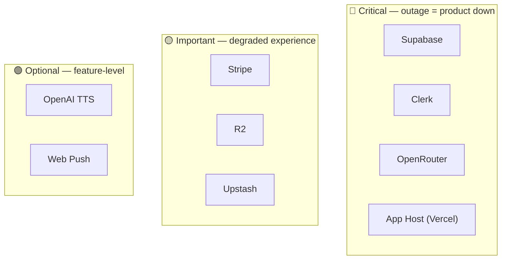
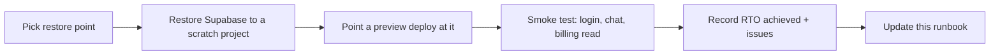
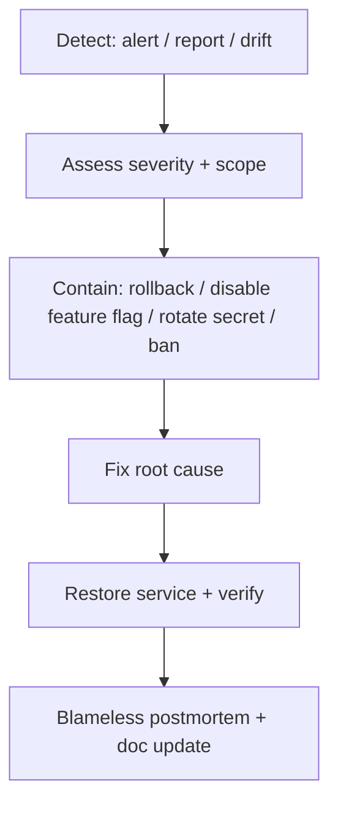

# 16 — Business Continuity & Disaster Recovery

> How Lucy survives outages, data loss, vendor failures, and security incidents. Includes RPO/RTO targets, backup strategy, failover options, key rotation, and an incident-response runbook.
>
> Targets and some specifics are **recommendations** (⚠️) — the codebase does not encode a DR policy; this document proposes one.

---

## 1. Recovery Objectives (recommended)

| Metric | Definition | Target |
|---|---|---|
| **RPO** (Recovery Point Objective) | Max acceptable data loss | ≤ 5 min (Supabase PITR) for DB; near-zero for code (Git) |
| **RTO** (Recovery Time Objective) | Max acceptable downtime | ≤ 1 hour for app; ≤ 4 hours for full DB restore |

---

## 2. Dependency Criticality

| Service | If it fails | Mitigation |
|---|---|---|
| **Supabase** | Total outage (no data) | PITR restore; logical dump to independent storage; ⚠️ no live replica today |
| **Clerk** | No logins | Vendor SLA; communicate; no app-side fallback |
| **OpenRouter** | No chat (core) | **Add provider fallback cascade** (top gap); cached model list buys minutes |
| **App host** | Site down | Instant rollback / redeploy; multi-region option |
| **Stripe** | No new upgrades | Existing access unaffected; queue/retry; users keep plan |
| **R2** | No uploads / broken media | Degrade gracefully; media is non-critical to chat |
| **Upstash** | Prod routes 503 | Have a break-glass to relax the prod-503 guard temporarily |
| **OpenAI** | No TTS | Feature off; chat unaffected |

---

## 3. Backup Strategy

| Asset | Primary | Secondary (recommended) |
|---|---|---|
| Postgres data | Supabase automated backup + **PITR** | Scheduled `pg_dump` → independent object storage (different vendor) |
| Schema | Git (`supabase/migrations/`) | — |
| Media (R2) | R2 durability | **Object versioning** + lifecycle; optional cross-bucket replication |
| Secrets | Host secret store | Encrypted offline copy (e.g. in a password manager / vault export) |
| Config (flags/economy) | `app_settings` table (in DB backups) | — |
| Code | GitHub | Mirror remote |

**Verification:** an untested backup is a liability. Schedule a **quarterly restore drill** (§6).

---

## 4. Failover & Vendor Lock-In

| Concern | Lock-in level | Exit strategy |
|---|---|---|
| **Clerk** | High (identity) | Clerk exports users; migrating means re-mapping `profiles.id` — significant. Keep `email` as a stable secondary key. |
| **Supabase** | Medium | It's standard Postgres — `pg_dump`/restore to any Postgres host; RLS uses `auth.jwt()` helpers that would need re-implementation. |
| **OpenRouter** | **Low** | Already an abstraction over many providers; can repoint to a direct provider or another router quickly. |
| **Stripe** | Medium | Standard subscription model; migrating billing is involved but well-trodden. |
| **R2** | Low | S3-compatible — repoint the S3 client to any S3 store. |
| **Upstash** | Low | Standard Redis interface. |

> **Architectural strength:** the two lowest-lock-in dependencies (OpenRouter, R2) are also abstracted behind clean interfaces (`lib/ai`, `lib/storage`). The highest lock-in (Clerk) is the identity anchor — plan any migration around stable email mapping.

---

## 5. Secret & Key Rotation

| Secret | Rotation trigger | Procedure |
|---|---|---|
| `SUPABASE_SERVICE_ROLE_KEY` | Suspected leak / quarterly | Rotate in Supabase → update host env → redeploy. **Highest priority** (god-mode). |
| `CLERK_SECRET_KEY` / webhook secret | Leak / quarterly | Rotate in Clerk → update env → re-verify webhook |
| `STRIPE_SECRET_KEY` / webhook secret | Leak / quarterly | Roll in Stripe → update env → re-point webhook |
| `OPENROUTER_API_KEY` | Leak / cost anomaly | Regenerate → update env |
| `R2_*` | Leak | New token → update env |
| `UPSTASH_*` | Leak | Rotate → update env |

**Rotation runbook:** rotate at the vendor → update host env (production scope) → redeploy or instant-rollback to pick up new values → verify the affected flow → revoke the old secret.

---

## 6. Restore / DR Drill (quarterly)

Validate: data integrity, coin-ledger drift (`coin_balance_check`), RLS still enforced, and that the documented RTO is actually achievable.

---

## 7. Incident Response Runbook

**Severity tiers (recommended):**
| Sev | Example | Response |
|---|---|---|
| **SEV1** | Data breach, total outage, payment failure at scale | All-hands, immediate containment, customer comms |
| **SEV2** | Core feature down (chat), AI provider outage | On-call, failover/rollback within RTO |
| **SEV3** | Degraded feature (TTS, uploads), elevated errors | Next-business-day fix; flag off if needed |

**Containment levers built into Lucy:**
- **Feature flags** (`app_settings`) — disable a broken feature instantly, no deploy.
- **Instant rollback** — promote the previous deployment.
- **Ban / auto-suspend** — stop an abusive actor.
- **Economy config** — adjust costs to throttle abuse.
- **Rate limits** — already gate request volume.

---

## 8. Communication & Records

- Maintain a **status page** and a customer-comms template for SEV1/2.
- Keep an **incident log** (date, severity, impact, root cause, fix, RTO/RPO achieved).
- After every incident, **update the relevant doc** in this package so the knowledge compounds.

---

## 9. Continuity Gaps To Close (prioritized)

| Priority | Gap |
|---|---|
| **P0** | No tested backup/restore drill → schedule + document |
| **P0** | No AI provider failover → add cascade in `character-chat.ts` |
| **P0** | No error alerting → integrate monitoring ([12](12-maintenance-guide.md)) |
| **P1** | No independent (off-vendor) DB dump → add scheduled `pg_dump` |
| **P1** | No secret-rotation automation/runbook execution record |
| **P2** | No multi-region DB read for geographic resilience |
