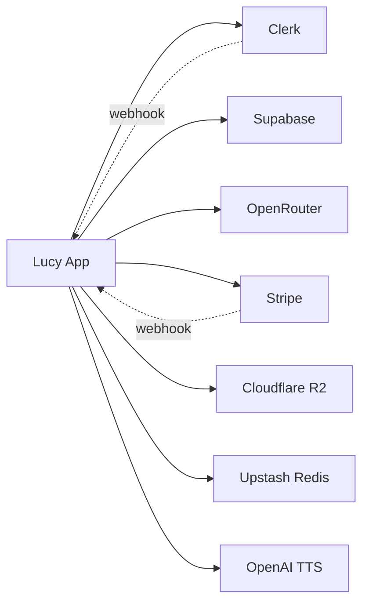

# 18 — Third-Party Services

> Every external service Lucy depends on: what it does, how it's integrated, its failure mode, and alternatives. Pairs with [17 — Environment Variables](17-environment-variables.md) and [16 — Business Continuity](16-business-continuity-guide.md).

---

## 1. Service Map

| Service | Category | Criticality | Lock-in |
|---|---|---|---|
| Clerk | Auth | 🔴 Critical | High |
| Supabase | Database | 🔴 Critical | Medium |
| OpenRouter | AI / LLM | 🔴 Critical | Low |
| App host (Vercel⚠️) | Hosting | 🔴 Critical | Medium |
| Stripe | Payments | 🟡 Important | Medium |
| Cloudflare R2 | Storage | 🟡 Important | Low |
| Upstash | Rate limiting | 🟡 Important | Low |
| OpenAI | TTS | 🟢 Optional | Low |
| Web Push | Notifications | 🟢 Optional | Low |

---

## 2. Clerk — Authentication & Identity

- **Purpose:** sign-up/in/out, sessions, OAuth, MFA, the user record, JWT issuance.
- **Integration:** `@clerk/nextjs` (`ClerkProvider`, `auth()`, `verifyWebhook`); hosted sign-in/up catch-all pages; `/api/webhooks/clerk` syncs users → `profiles`.
- **Config:** publishable + secret + webhook secret; JWT template must expose `sub` + `metadata.role`; Supabase configured to trust Clerk JWTs.
- **Failure mode:** no logins (full product block); existing sessions may continue until expiry.
- **Alternatives:** Auth0, Supabase Auth, WorkOS, Firebase Auth — migration requires re-mapping `profiles.id`; keep email as stable key.

---

## 3. Supabase — Database

- **Purpose:** PostgreSQL data store, Row-Level Security, Realtime, type generation.
- **Integration:** `@supabase/supabase-js` with three clients (anon/server/service-role); schema via `supabase/migrations/`; RLS keyed to Clerk JWT `sub`.
- **Config:** URL + anon + service-role keys; third-party-auth (Clerk) trust.
- **Failure mode:** total product outage (no data). Mitigate with PITR + independent dumps.
- **Alternatives:** any managed Postgres (Neon, RDS, Cloud SQL) — it's standard Postgres; RLS `auth.jwt()` helpers would need re-implementation.

---

## 4. OpenRouter — LLM Router

- **Purpose:** single API to 100+ chat models; per-character model selection; usage/cost reporting.
- **Integration:** `lib/ai/openrouter.ts` + `character-chat.ts`; `/v1/chat/completions` (streaming) and `/v1/models` (cached 5 min). Headers: `Authorization`, `X-Title: Lucy`, `HTTP-Referer`.
- **Config:** `OPENROUTER_API_KEY`, optional default/image model.
- **Failure mode:** **core feature down** (no chat). ⚠️ No automatic failover today — the #1 reliability gap.
- **Alternatives:** direct provider APIs (OpenAI/Anthropic), Together, Fireworks, self-hosted. Low lock-in — already an abstraction.

---

## 5. Stripe — Payments

- **Purpose:** subscription checkout, recurring billing, invoices.
- **Integration:** `lib/stripe.ts`, `lib/billing/sync-subscription.ts`; `/api/subscription/*`; `/api/webhooks/stripe` (4 events). Price ids map to plans.
- **Config:** secret + webhook secret + two price ids.
- **Failure mode:** no new upgrades/renewals; existing access unaffected; webhooks retry.
- **Alternatives:** Paddle, Lemon Squeezy, Chargebee — billing migration is involved but standard.

---

## 6. Cloudflare R2 — Object Storage

- **Purpose:** user uploads + generated/character media.
- **Integration:** `lib/storage/r2.ts` via AWS S3 SDK + presigner; `/api/upload` returns presigned PUT URLs (browser → R2 directly, 10 MB cap). `media_assets` tracks references.
- **Config:** account id, access key/secret, bucket, public URL.
- **Failure mode:** uploads fail; existing media may be unavailable — non-critical to chat.
- **Verification:** `npm run test:r2` ([20 — R2 Operations](20-r2-storage-testing.md)); admin file browser at `/admin/storage`.
- **Alternatives:** AWS S3, Backblaze B2, Supabase Storage — S3-compatible, trivial repoint.

---

## 7. Upstash Redis — Rate Limiting

- **Purpose:** sliding-window rate limits (api/subscription/webhook).
- **Integration:** `lib/rate-limit.ts` (`@upstash/ratelimit` + `@upstash/redis`).
- **Config:** REST URL + token.
- **Failure mode:** in **prod**, rate-limited routes return 503 if unconfigured (fail-closed). In dev, limiters no-op.
- **Alternatives:** any Redis (with REST), or a different limiter store.

---

## 8. OpenAI — Text-to-Speech (optional)

- **Purpose:** voice synthesis for messages (Premium+).
- **Integration:** `lib/voice/tts.ts` (`tts-1`, voice `nova`, MP3); `/api/voice/tts`.
- **Config:** `OPENAI_API_KEY`.
- **Failure mode:** TTS off; chat unaffected.
- **Alternatives:** ElevenLabs, PlayHT, Azure/Google TTS.

---

## 9. Web Push (optional)

- **Purpose:** re-engagement notifications.
- **Integration:** `/api/push/subscribe` stores subscriptions; `NEXT_PUBLIC_VAPID_PUBLIC_KEY` on the client.
- **Status:** capture only — **sending not implemented**; a private VAPID key + sender would be needed.
- **Alternatives:** OneSignal, Firebase Cloud Messaging.

---

## 10. App Host (inferred: Vercel)

- **Purpose:** serverless functions + edge CDN + Git-based deploy.
- **Integration:** Next.js native; CI lints/builds, host deploys.
- **Failure mode:** site down; mitigate with instant rollback / multi-region.
- **Alternatives:** Netlify, Cloudflare (OpenNext), AWS Amplify, self-hosted Node.
- **⚠️ Assumption:** no host manifest committed; Vercel assumed.

---

## 11. Dependency Summary & Hardening

| Service | SLA dependency | Hardening recommendation |
|---|---|---|
| Clerk | Login uptime | Monitor; comms plan |
| Supabase | Data uptime | PITR + independent dumps + restore drill |
| OpenRouter | Chat uptime | **Add fallback cascade** + cost circuit breaker |
| Stripe | Revenue | Webhook-failure alerting; idempotent (already) |
| R2 | Media | Object versioning; CDN |
| Upstash | Throttling | Size for peak; break-glass for the 503 guard |
| OpenAI | Voice | Feature-flag controlled |
| Host | Availability | Rollback + region strategy |

> **Operational truth-sources:** Stripe = payment truth, Clerk = identity truth, Supabase = app-state truth. Cross-check all three when diagnosing ([14 §9](14-troubleshooting-guide.md)).
