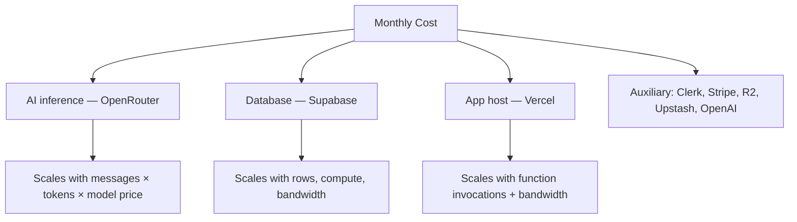

# 19 — Cost Analysis

> A cost model for operating Lucy and the unit economics of its plans.
>
> **⚠️ Major assumption notice:** No billing dashboards, contracts, or real usage metrics were available. **Every dollar figure below is an industry-typical estimate for planning only.** Validate against actual vendor invoices before relying on these numbers. The *structure* of the analysis is sound; the *magnitudes* are illustrative.

---

## 1. Cost Drivers

**Order of magnitude:** at low scale, *fixed* platform fees (Clerk/Supabase/host plans) dominate. As users grow, **AI inference becomes the largest variable cost** — and the one the coin economy is designed to contain.

---

## 2. Per-Service Fixed Costs (estimated baseline)

> Free tiers cover early development; the table shows the **paid baseline** a small production deployment typically incurs.

| Service | Plan assumption | Est. monthly (⚠️) |
|---|---|---|
| App host (Vercel) | Pro | ~$20 |
| Supabase | Pro | ~$25 |
| Clerk | Pro (after free MAU) | ~$25+ |
| Upstash | Pay-as-you-go | ~$0–10 |
| Cloudflare R2 | Storage + ops | ~$0–15 |
| Stripe | % of revenue (no fixed) | 2.9% + $0.30/txn |
| OpenRouter | Usage-based | see §3 |
| OpenAI TTS | Usage-based (optional) | see §3 |
| **Fixed subtotal** | | **~$95–115/mo** |

---

## 3. Variable (Usage) Costs

### AI chat (OpenRouter)
- **Default model is free-tier** (`kimi-k2.6:free`) → baseline chat ≈ **$0**.
- On a **paid model**, assume ⚠️ ~$0.0003–$0.002 per message (prompt+completion, `max_tokens 300`).
- The coin gate (1 coin/text) ties spend to consumable budget.

### Image generation
- 20 coins each. Real cost depends on the image model (⚠️ ~$0.01–$0.04/image on typical providers).

### Voice (OpenAI TTS)
- 10 coins/min. `tts-1` ≈ ⚠️ ~$0.015 per 1K characters (~$0.06–$0.12 per spoken minute depending on length).

### Stripe
- ~2.9% + $0.30 per successful charge. On $14.99 ≈ **$0.73**; on $39.99 ≈ **$1.46**.

---

## 4. Per-Plan Unit Economics (illustrative)

Assumptions (⚠️): paid users active; free models for Free tier, modest paid-model usage for paying tiers; coins fully consumed.

| | Free | Premium ($14.99) | Ultimate ($39.99) |
|---|---|---|---|
| Monthly coins | 100 | 2,000 | 6,000 |
| Revenue | $0 | $14.99 | $39.99 |
| Stripe fee | $0 | ~$0.73 | ~$1.46 |
| Est. AI/voice/image cost (⚠️) | ~$0 (free model) | ~$1–4 | ~$4–12 |
| Allocated fixed cost/user | ~$0.02 | ~$0.05 | ~$0.05 |
| **Est. gross margin** | **−(small)** | **~$10–13 (≈70–85%)** | **~$26–34 (≈65–85%)** |

**Reading:** Free users are a **deliberate, low-cost acquisition loss** (free model keeps their cost near zero). Paid tiers carry **healthy SaaS-like margins** *as long as* coin allowances and model choice keep AI cost bounded — which the economy + `max_tokens` cap are designed to do.

> The admin **Unit Economics** view (`/api/admin/unit-economics`) computes the *real* version of this table from logged `costUsd` per reply — use it instead of these estimates once live.

---

## 5. Illustrative Total Cost of Ownership

> Pure illustration (⚠️) — assumes a given paid-conversion mix; replace with real data.

| Users (paid %) | Fixed | AI/variable (est.) | Stripe (est.) | Est. total/mo | Est. revenue | Est. net |
|---|---|---|---|---|---|---|
| 1,000 (3% paid) | ~$110 | ~$50 | ~$25 | ~$185 | ~$600 | **+$415** |
| 10,000 (4%) | ~$250 | ~$600 | ~$350 | ~$1,200 | ~$8,000 | **+$6,800** |
| 50,000 (5%) | ~$800 | ~$4,000 | ~$2,200 | ~$7,000 | ~$50,000 | **+$43,000** |
| 100,000 (5%) | ~$2,000 | ~$9,000 | ~$4,500 | ~$15,500 | ~$100,000 | **+$84,500** |

> These ignore non-infra costs (salaries, marketing, support, refunds, chargebacks) and assume the coin economy contains AI spend. They illustrate that **the model is structurally profitable if conversion and AI cost control hold.**

---

## 6. Cost Optimization Levers (built-in & recommended)

| Lever | Status | Effect |
|---|---|---|
| Free-tier default model | ✅ built-in | Free users ≈ $0 AI cost |
| `max_tokens 300` cap | ✅ built-in | Bounds per-reply cost |
| Coin gating | ✅ built-in | Caps per-user consumption |
| Per-plan model tiering (allow-list) | ✅ capable | Cheap models for Free, premium for paid |
| Usage/cost logging | ✅ built-in | Spot expensive models before they erode margin |
| Model-list caching | ✅ built-in | Avoids redundant API calls |
| **Per-user $ circuit breaker** | ⬜ recommended | Stops abuse/viral cost spikes |
| **Async/queue side effects** | ⬜ recommended (at scale) | Reduces compute |
| **Edge caching + R2 CDN** | ⬜ recommended | Cuts bandwidth/compute |
| **DB archival of old messages** | ⬜ recommended | Controls Supabase storage cost |

---

## 7. Cost Risks

| Risk | Mitigation |
|---|---|
| Viral spike → AI bill shock | Per-user cost cap + coin gating + rate limits |
| Expensive model added to allow-list | Test + monitor `costUsd`; tier by plan |
| Free-tier abuse (bots) | Rate limits + abuse auto-suspend + signup friction |
| Stripe fees eroding low-price tiers | Already modeled; annual plans reduce per-txn fees |
| Storage growth (media + messages) | R2 lifecycle + DB archival |

---

## 8. Recommendations

1. **Replace these estimates with real data** from the admin unit-economics view + vendor invoices within the first month of operation.
2. **Add a per-user daily $ circuit breaker** before any growth push.
3. **Tier models by plan** explicitly (free models for Free, premium for paid) to protect margin.
4. **Track gross margin per plan monthly**; if AI cost approaches coin-allowance value, adjust allowances or model choice.
5. **Offer annual billing** to cut Stripe per-transaction overhead and improve retention/cash flow.
